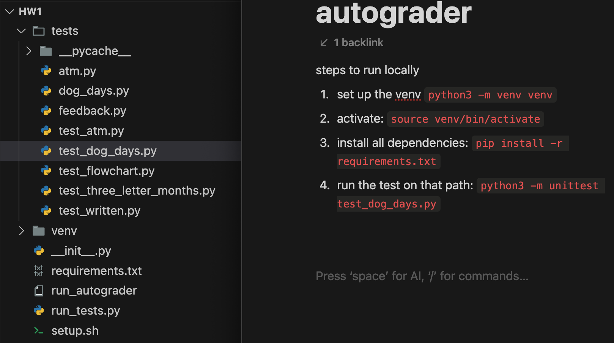
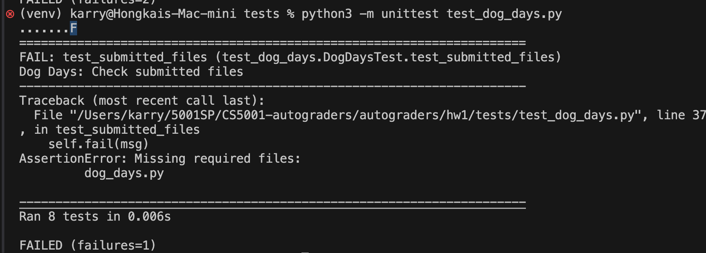

# Autograder Documentation
## Usage of Git
Before we start the new HW, make sure we fetch and update the latest version of Autograder first.
1. `git fetch origin`

    This command will update the information about remote branches in our local repository but won't change my current branch or working directory. This step can ensure we have the latest list of branches from the remote repository.

2. `git pull origin main`

    This command will update our local repository with the latest changes from the `main` branch. 

3. `git checkout -b esther-hw6`

    This command is used to create a new branch named `esther-hw6` and immediately switch to it. The `-b` flag tells Git to create a new branch. If the branch `esther-hw6` does not exist, Git will create it based on the current branch you are on.

4. `git push origin esther-hw6`

    This command will push the commits from our local branch `esther-hw6` to the remote repository. If the branch doesn't exist on the remote, it will be created. However, without `-u`, our local branch will not set up a tracking relationship with the remote branch. This means that in the future, we'll have to specify the remote and branch names explicitly when pushing or pulling.

5. `git branch`

    This command will display a list of all local branches. The branch we're currently on will be highlighted and marked with an asterisk (*).

6. `git branch -D branch_name`

    The `-D` option is a **force** operation. It deletes the branch regardless of its merge status. Use this with caution, as it can lead to losing unmerged changes.

7. `git checkout esther-hw6`

    we can use this to check uncommitted or unupdated changes.

## Test Environment
### Steps to Run Locally
**1. set up the venv:** `python3 -m venv/venv` (in the current hw folder, and in the same level as the `tests/` folder)

**2. activate:** `source venv/bin/activate`

**3. install all dependencies:** `pip install -r requirements.txt`

**4. run the test on that path:** `python3 -m unittest test_dog_days.py` (We need to cd `tests/` folder to run these test files)



5. the failure of `AssertionError: Missing required files` is correct when running tests locally. Just ignore it!
   



## Test Function File
1. AST 
check if certain function contains something?

2. use `call_verify` to test each function (mainly the output of the function)
```
@weight(0.08)
@visibility("visible")
def test_get_average_invalid_drop_lowest2(self):
    '''gradebook: Test get_average with invalid drop_lowest'''
    numbers = [1, 2, 3, 4, 5]
    drop_lowest = -1
    expected = 3.0
    self.call_verify(expected, 'get_average', numbers, drop_lowest)
```
just call call_verify directly.
if we want to display customized message to students, then we need to write test code in a different way.
```
def call_verify(self, expected, function_name, *args, **kwargs):
    """
    This function is a helper function for the test cases. 
    It calls the verify function and then compares the actual and expected values.
    """
    passed, actual, msg = verify(
        self.expected_module, function_name, expected, *args, **kwargs)

    # if verify returns False, then the test failed
    if not passed:
        self.fail(msg)

    # otherwise, compare the actual and expected values
    self.assertEqual(actual, expected, msg)
```
we don't have to use `call_verify`. we can write some customized test code ourselves.
especially for this part:
```
imported_module = __import__(self.expected_module)
get_neighbourhood_with_most_parks = getattr(imported_module, 'get_neighbourhood_with_most_parks', None)
```
```
########################################
# Test get_neighbourhood_with_most_parks functionality
########################################

# Check that get_neighbourhood_with_most_parks returns a list and the content of the list matches the expected outcome
@weight(0)
@visibility("visible")
def test_get_neighbourhood_with_most_parks_returns_list(self):
    """parks_functions: Check that get_neighbourhood_with_most_parks returns a list"""
    # Sample data to pass to the function
    sample_neighbourhood_park_dictionary = {
        'Neighbourhood1': ['Park1', 'Park2'],
        'Neighbourhood2': ['Park3'],
        'Neighbourhood3': ['Park4', 'Park5', 'Park6'],
    }

    # Expected result for the given sample data
    # For example, if multiple neighbourhoods have the same max number of parks, include them all
    expected_result = ['Neighbourhood3']

    # Import the module and function to test
    imported_module = __import__(self.expected_module)
    get_neighbourhood_with_most_parks = getattr(imported_module, 'get_neighbourhood_with_most_parks', None)

    # Ensure the function exists
    self.assertIsNotNone(get_neighbourhood_with_most_parks, msg="Function get_neighbourhood_with_most_parks is not defined")

    # Call the function with the sample data
    result = get_neighbourhood_with_most_parks(sample_neighbourhood_park_dictionary)

    # Verify the result is a list
    self.assertIsInstance(result, list, "The return type of function get_neighbourhood_with_most_parks() should be a list.")
    
    # Verify the result matches the expected output
    # Verify the result matches the expected output
    self.assertEqual(result, expected_result, f"The return type of function get_neighbourhood_with_most_parks() is correct (list), but the elements inside the list are not as expected. Expected {expected_result} but got {result}. \
Ensure your function correctly identifies the neighbourhood(s) with the most parks.")
```
## Test the Driver File
1. checks the existence of display_neighbourhood_with_most_parks but also displays a descriptive message if the function does not exist
```
# Test display_neighbourhood_with_most_parks exists
@weight(0)
@visibility("visible")
def test_display_neighbourhood_with_most_parks_exist(self):
    """parks_driver: Test that display_neighbourhood_with_most_parks exists"""
    # Attempt to import the expected module
    exec(f"import {self.expected_module}")
    # Check if the function exists in the imported module
    function_exists = hasattr(eval(f"{self.expected_module}"), 'display_neighbourhood_with_most_parks')
    # Assert that the function exists, with a custom message if it does not
    self.assertTrue(function_exists, f"The function 'display_neighbourhood_with_most_parks' does not exist in the {self.expected_module} file. \
Please ensure you have implemented this function as required.")
```
2. check if a certain function is called/not called in `main`
```
# check if the display_neighbourhood_with_most_parks function is called at least once anywhere in the entire driver file
@weight(0)
@visibility("visible")
def test_parks_driver_calls_display_function(self):
    """parks_driver: Check that main calls display_neighbourhood_with_most_parks"""
    # read file into a string
    with open(self.expected_filename[0], 'r') as f:
        code = f.read()
    pedal.contextualize_report(code)
    pedal.ensure_function_call('display_neighbourhood_with_most_parks', 1)  # 1 indicates the minimum number of expected calls
    res = pedal.resolvers.simple.resolve()
    self.assertTrue(res.success, res.message)   
```

4. test the output of the entire program (not just one function)
5. test if they use `if __name__ == "__main__"`

## Static Code Check
1. check import statements
* check `import sys`
```
@weight(0)
@visibility("visible")
def test_imports_exist_funtions(self):
    """parks_cli: Check that parks_cli imports sys"""
    with open(self.expected_filename[0], 'r') as f:
        code = f.read()
    pedal.contextualize_report(code)
    pedal.ensure_import('sys')
    res = pedal.resolvers.simple.resolve()
    self.assertTrue(res.success, res.message)
```
* check `from function_file import function1`, only import one function or stuff
```
# Ensure that the driver file specifically imports only run_menu from menu_functions and no other functions
@weight(0.2)
@visibility("visible")
def test_specific_import_run_menu(self):
    """menu_driver: Check that only 'run_menu' is imported from 'menu_functions'"""
    with open(self.expected_filename[0], 'r') as f:
        code = f.read()
    # parses the driver file using ast.parse
    ast_tree = ast.parse(code)
    found_import = False
    for node in ast.walk(ast_tree):
        # Inspect the ast.ImportFrom nodes to check if menu_functions is the module being imported from and run_menu is the only name being imported.
        if isinstance(node, ast.ImportFrom):
            if node.module == 'menu_functions':
                imported_names = [alias.name for alias in node.names]
                if 'run_menu' in imported_names and len(imported_names) == 1:
                    found_import = True
                    break
    if not found_import:
        self.fail("The 'run_menu' function should be the only import from 'menu_functions'.")
```
